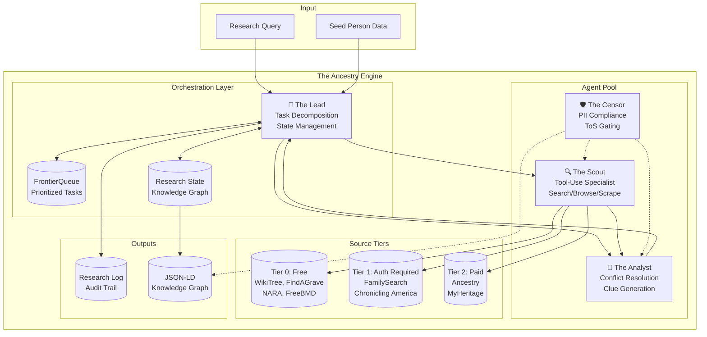
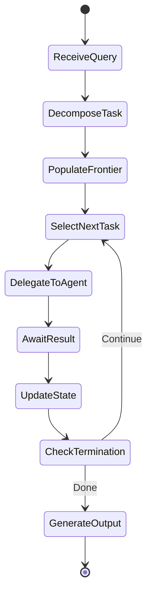
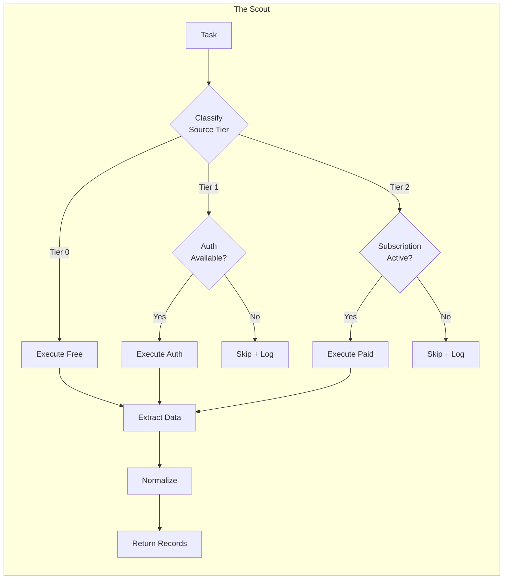
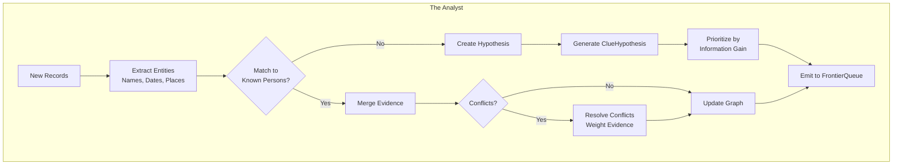
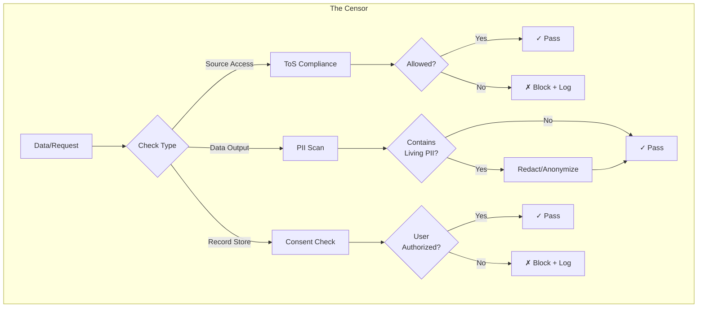
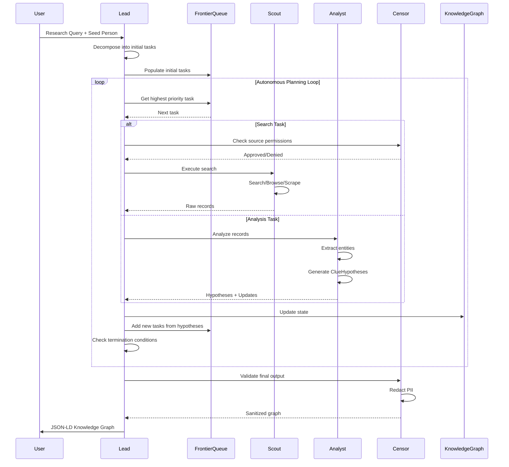
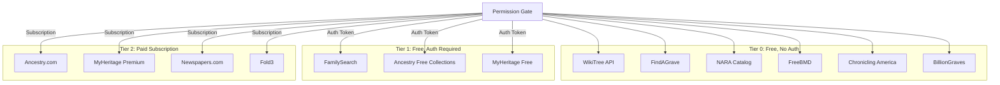
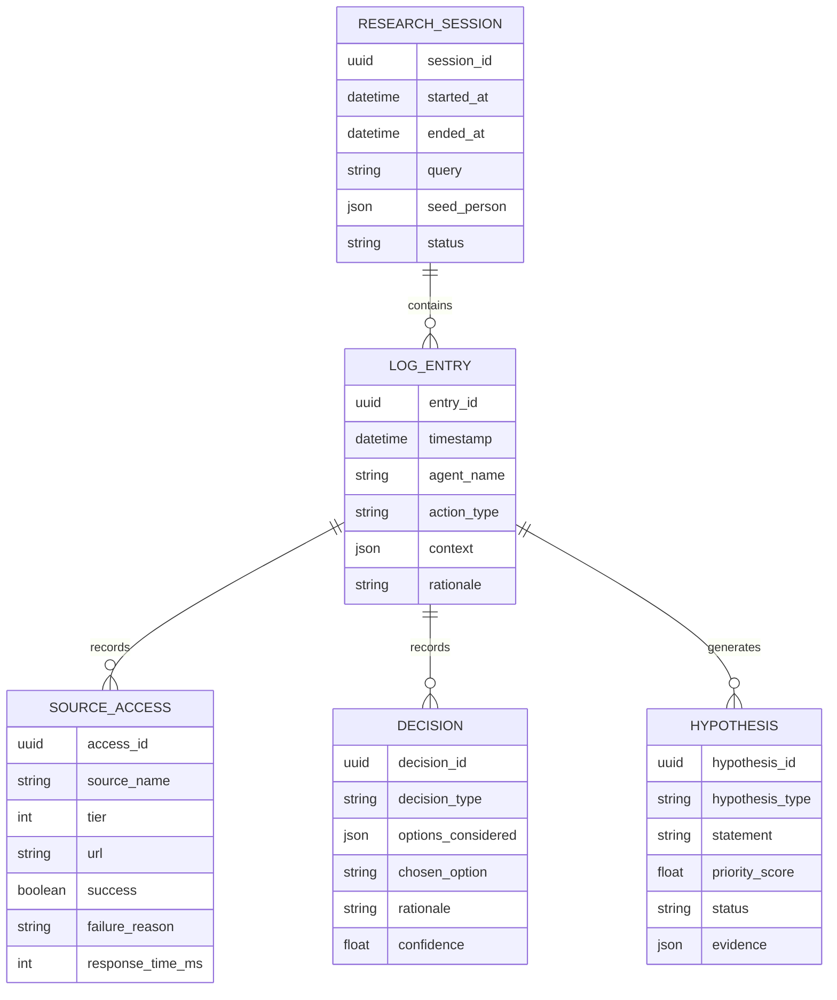
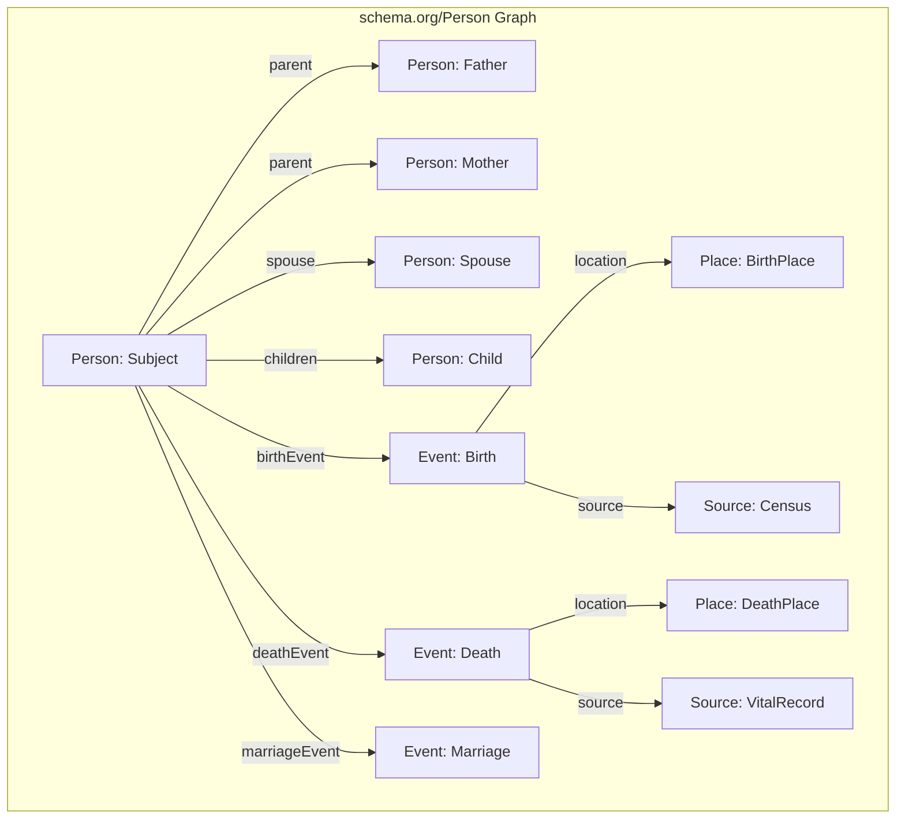
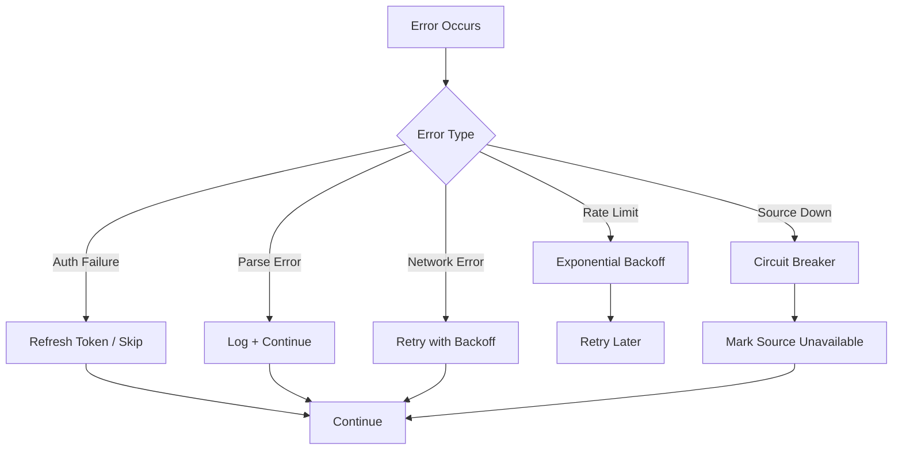

# The Ancestry Engine: Multi-Agent Genealogical Research System

## Overview

The Ancestry Engine is an autonomous multi-agent system designed for genealogical research following the Genealogical Proof Standard (GPS). It employs four specialized agents coordinated through a Plan-and-Execute loop implemented in LangGraph.

## System Architecture



## Agent Responsibilities

### 1. The Lead (Orchestrator)



**Responsibilities:**
- Task decomposition: Breaks research queries into atomic tasks
- State management: Maintains the evolving knowledge graph
- Priority queue management: Orders tasks by expected information gain
- Termination detection: Recognizes when research goals are met

### 2. The Scout (Tool Specialist)



**Tools Available:**
- `search_source(source, query)` - Search a genealogical source
- `browse_record(url)` - Navigate to and parse a record
- `scrape_document(url, selectors)` - Extract structured data
- `fetch_image(url)` - Retrieve document images
- `ocr_document(image)` - Extract text from images

### 3. The Analyst (Intelligence)



**Clue Generation Logic:**
- New name discovered → Generate "Find vital records for {name}" hypothesis
- New location discovered → Generate "Search {location} records" hypothesis
- Date range identified → Generate "Search {year} census" hypothesis
- Relationship implied → Generate "Verify {relationship}" hypothesis

### 4. The Censor (Compliance)



**Compliance Rules:**
- No scraping sources that prohibit it in ToS
- Redact SSNs, living person addresses, etc.
- Rate limit requests per source
- Log all compliance decisions

## Data Flow: Plan-and-Execute Loop



## Source Tier System



## Research Log Structure



## JSON-LD Knowledge Graph Output



## Termination Conditions

The Lead agent terminates the research loop when ANY of these conditions are met:

1. **Goal Achieved**: All research questions answered with sufficient evidence
2. **Exhaustion**: FrontierQueue is empty (no more hypotheses to explore)
3. **Budget Exceeded**: Maximum API calls or time limit reached
4. **GPS Satisfied**: Primary + corroborating secondary sources found for all claims
5. **User Interrupt**: Manual stop requested

## Error Handling



## Formal Specification (Z Notation)

The following Z notation specification serves as the **source of truth** for the Ancestry Engine business logic.

### Basic Types

```
[NAME]          -- Set of all person names
[DATE]          -- Set of all dates
[PLACE]         -- Set of all place identifiers
[URL]           -- Set of all URLs
[UUID]          -- Set of all unique identifiers
[TEXT]          -- Set of all text strings

TIER ::= Tier0 | Tier1 | Tier2

AGENT ::= Lead | Scout | Analyst | Censor

TASK_TYPE ::= SearchTask | AnalyzeTask | VerifyTask | ResolveTask

HYPOTHESIS_STATUS ::= Pending | InProgress | Completed | Rejected

DECISION ::= Accept | Reject | Defer

EVIDENCE_TYPE ::= Primary | Secondary | Authored
```

### Person Schema

```
┌─ Person ─────────────────────────────────────────────┐
│ id : UUID                                            │
│ givenName : NAME                                     │
│ surname : NAME                                       │
│ birthDate : ℙ DATE                                   │
│ deathDate : ℙ DATE                                   │
│ birthPlace : ℙ PLACE                                 │
│ deathPlace : ℙ PLACE                                 │
│ parents : ℙ UUID                                     │
│ spouses : ℙ UUID                                     │
│ children : ℙ UUID                                    │
│ sources : ℙ SourceCitation                           │
├──────────────────────────────────────────────────────┤
│ #parents ≤ 2                                         │
│ id ∉ parents ∪ spouses ∪ children                   │
└──────────────────────────────────────────────────────┘
```

### Source Citation Schema

```
┌─ SourceCitation ─────────────────────────────────────┐
│ id : UUID                                            │
│ repository : TEXT                                    │
│ tier : TIER                                          │
│ url : URL                                            │
│ accessedAt : DATE                                    │
│ evidenceType : EVIDENCE_TYPE                         │
│ originalText : ℙ TEXT                                │
│ confidence : ℝ                                       │
├──────────────────────────────────────────────────────┤
│ 0 ≤ confidence ≤ 1                                   │
└──────────────────────────────────────────────────────┘
```

### Clue Hypothesis Schema

```
┌─ ClueHypothesis ──────────────────────────────────────┐
│ id : UUID                                             │
│ statement : TEXT                                      │
│ targetPerson : ℙ UUID                                 │
│ suggestedSources : ℙ TEXT                             │
│ priority : ℝ                                          │
│ status : HYPOTHESIS_STATUS                            │
│ generatedBy : AGENT                                   │
│ evidence : ℙ SourceCitation                           │
├───────────────────────────────────────────────────────┤
│ 0 ≤ priority ≤ 1                                      │
│ generatedBy = Analyst                                 │
└───────────────────────────────────────────────────────┘
```

### Task Schema

```
┌─ Task ────────────────────────────────────────────────┐
│ id : UUID                                             │
│ taskType : TASK_TYPE                                  │
│ priority : ℝ                                          │
│ assignedTo : ℙ AGENT                                  │
│ hypothesis : ℙ ClueHypothesis                         │
│ sourceConstraint : ℙ TIER                             │
│ completed : 𝔹                                         │
├───────────────────────────────────────────────────────┤
│ 0 ≤ priority ≤ 1                                      │
│ taskType = SearchTask ⇒ assignedTo = {Scout}          │
│ taskType = AnalyzeTask ⇒ assignedTo = {Analyst}       │
└───────────────────────────────────────────────────────┘
```

### System State Schema

```
┌─ AncestryEngineState ─────────────────────────────────┐
│ knowledgeGraph : UUID ⇸ Person                        │
│ frontierQueue : seq Task                              │
│ completedTasks : ℙ Task                               │
│ hypotheses : ℙ ClueHypothesis                         │
│ researchLog : seq LogEntry                            │
│ sourcePermissions : TIER → 𝔹                          │
│ activeAgent : ℙ AGENT                                 │
│ terminated : 𝔹                                        │
├───────────────────────────────────────────────────────┤
│ ∀ t : ran frontierQueue • ¬ t.completed               │
│ ∀ t : completedTasks • t.completed                    │
│ sourcePermissions(Tier0) = true                       │
│ terminated ⇒ frontierQueue = ⟨⟩                       │
└───────────────────────────────────────────────────────┘
```

### Initial State

```
┌─ InitAncestryEngine ──────────────────────────────────┐
│ AncestryEngineState'                                  │
│ seedPerson? : Person                                  │
│ query? : TEXT                                         │
├───────────────────────────────────────────────────────┤
│ knowledgeGraph' = {seedPerson?.id ↦ seedPerson?}     │
│ frontierQueue' = ⟨initialTask(seedPerson?, query?)⟩   │
│ completedTasks' = ∅                                   │
│ hypotheses' = ∅                                       │
│ researchLog' = ⟨⟩                                     │
│ sourcePermissions' = {Tier0 ↦ true, Tier1 ↦ ?, Tier2 ↦ ?} │
│ activeAgent' = ∅                                      │
│ terminated' = false                                   │
└───────────────────────────────────────────────────────┘
```

### The Lead: Task Selection Operation

```
┌─ LeadSelectTask ──────────────────────────────────────┐
│ ΔAncestryEngineState                                  │
│ selectedTask! : Task                                  │
├───────────────────────────────────────────────────────┤
│ ¬ terminated                                          │
│ frontierQueue ≠ ⟨⟩                                    │
│ selectedTask! = head(sortByPriority(frontierQueue))   │
│ frontierQueue' = tail(sortByPriority(frontierQueue))  │
│ activeAgent' = selectedTask!.assignedTo               │
│ researchLog' = researchLog ⁀ ⟨taskSelectionEntry(selectedTask!)⟩ │
└───────────────────────────────────────────────────────┘

── Priority ordering predicate
sortByPriority : seq Task → seq Task
∀ s : seq Task •
  ∀ i, j : dom s • i < j ⇒ (sortByPriority(s))(i).priority ≥ (sortByPriority(s))(j).priority
```

### The Scout: Source Access Operation

```
┌─ ScoutSearchSource ───────────────────────────────────┐
│ ΔAncestryEngineState                                  │
│ task? : Task                                          │
│ records! : ℙ RawRecord                                │
├───────────────────────────────────────────────────────┤
│ Scout ∈ activeAgent                                   │
│ task?.taskType = SearchTask                           │
│                                                       │
│ ── Permission check (gating)                          │
│ ∀ tier : task?.sourceConstraint •                     │
│   sourcePermissions(tier) = true                      │
│                                                       │
│ ── Execute search within permitted tiers              │
│ records! = executeSearch(task?, sourcePermissions)    │
│                                                       │
│ ── Log the access                                     │
│ researchLog' = researchLog ⁀ ⟨sourceAccessEntry(task?, records!)⟩ │
│ activeAgent' = ∅                                      │
└───────────────────────────────────────────────────────┘

── Permission gating predicate
┌─ SourcePermissionGate ────────────────────────────────┐
│ tier? : TIER                                          │
│ allowed! : 𝔹                                          │
│ sourcePermissions : TIER → 𝔹                          │
├───────────────────────────────────────────────────────┤
│ allowed! = sourcePermissions(tier?)                   │
│ tier? = Tier0 ⇒ allowed! = true                       │
└───────────────────────────────────────────────────────┘
```

### The Analyst: Hypothesis Generation Operation

```
┌─ AnalystGenerateHypotheses ───────────────────────────┐
│ ΔAncestryEngineState                                  │
│ records? : ℙ RawRecord                                │
│ newHypotheses! : ℙ ClueHypothesis                     │
├───────────────────────────────────────────────────────┤
│ Analyst ∈ activeAgent                                 │
│                                                       │
│ ── Extract entities from records                      │
│ let entities == extractEntities(records?)             │
│                                                       │
│ ── Generate hypotheses for new names                  │
│ let nameHypotheses == {h : ClueHypothesis |           │
│   ∃ n : entities.names • n ∉ dom knowledgeGraph •     │
│   h.statement = "Find vital records for " ⁀ n ∧       │
│   h.priority = calculatePriority(n, knowledgeGraph)}  │
│                                                       │
│ ── Generate hypotheses for new locations              │
│ let placeHypotheses == {h : ClueHypothesis |          │
│   ∃ p : entities.places •                             │
│   h.statement = "Search records in " ⁀ p ∧           │
│   h.priority = calculatePriority(p, knowledgeGraph)}  │
│                                                       │
│ newHypotheses! = nameHypotheses ∪ placeHypotheses     │
│ hypotheses' = hypotheses ∪ newHypotheses!             │
│                                                       │
│ ── Add new tasks to frontier                          │
│ frontierQueue' = frontierQueue ⁀ hypothesesToTasks(newHypotheses!) │
│                                                       │
│ ── Log rationale                                      │
│ researchLog' = researchLog ⁀ ⟨hypothesisEntry(newHypotheses!)⟩ │
└───────────────────────────────────────────────────────┘

── Priority calculation based on information gain
calculatePriority : (NAME ∪ PLACE) × (UUID ⇸ Person) → ℝ
∀ e : NAME ∪ PLACE; g : UUID ⇸ Person •
  calculatePriority(e, g) =
    let existingEvidence == countEvidence(e, g) in
    1 - (existingEvidence / (existingEvidence + 1))
```

### The Analyst: Conflict Resolution Operation

```
┌─ AnalystResolveConflict ──────────────────────────────┐
│ ΔAncestryEngineState                                  │
│ person? : Person                                      │
│ conflictingClaims? : ℙ (TEXT × SourceCitation)        │
│ resolution! : TEXT × SourceCitation                   │
├───────────────────────────────────────────────────────┤
│ Analyst ∈ activeAgent                                 │
│ #conflictingClaims? ≥ 2                               │
│                                                       │
│ ── Weight by evidence type and source tier            │
│ let weights == {(claim, src) : conflictingClaims? •   │
│   evidenceWeight(src.evidenceType) ×                  │
│   tierWeight(src.tier) ×                              │
│   src.confidence}                                     │
│                                                       │
│ ── Select highest weighted claim                      │
│ resolution! = argmax(weights)                         │
│                                                       │
│ ── Update knowledge graph                             │
│ knowledgeGraph' = knowledgeGraph ⊕                    │
│   {person?.id ↦ applyResolution(person?, resolution!)}│
│                                                       │
│ ── Log resolution rationale                           │
│ researchLog' = researchLog ⁀                          │
│   ⟨conflictResolutionEntry(conflictingClaims?, resolution!)⟩ │
└───────────────────────────────────────────────────────┘

── Evidence weight function
evidenceWeight : EVIDENCE_TYPE → ℝ
evidenceWeight(Primary) = 1.0
evidenceWeight(Secondary) = 0.7
evidenceWeight(Authored) = 0.4

── Tier weight function
tierWeight : TIER → ℝ
tierWeight(Tier0) = 0.8
tierWeight(Tier1) = 0.9
tierWeight(Tier2) = 1.0
```

### The Censor: PII Compliance Operation

```
┌─ CensorValidateOutput ────────────────────────────────┐
│ ΞAncestryEngineState                                  │
│ data? : Person                                        │
│ sanitized! : Person                                   │
│ violations! : ℙ TEXT                                  │
├───────────────────────────────────────────────────────┤
│ Censor ∈ activeAgent                                  │
│                                                       │
│ ── Check for living person (born < 100 years ago, no death) │
│ let isLiving == data?.birthDate ≠ ∅ ∧                 │
│   max(data?.birthDate) > currentYear - 100 ∧         │
│   data?.deathDate = ∅                                 │
│                                                       │
│ ── Redact if living                                   │
│ isLiving ⇒                                            │
│   sanitized! = redactLivingPII(data?) ∧               │
│   violations! = {"Living person PII redacted"}        │
│                                                       │
│ ¬isLiving ⇒                                           │
│   sanitized! = data? ∧                                │
│   violations! = ∅                                     │
└───────────────────────────────────────────────────────┘

── PII redaction function
redactLivingPII : Person → Person
∀ p : Person •
  redactLivingPII(p) = p ⊕ {
    birthDate ↦ {approximateDecade(max(p.birthDate))},
    birthPlace ↦ {generalizePlace(head(p.birthPlace))}
  }
```

### The Censor: ToS Compliance Gate

```
┌─ CensorCheckSourceAccess ─────────────────────────────┐
│ ΞAncestryEngineState                                  │
│ source? : TEXT                                        │
│ action? : TEXT                                        │
│ allowed! : 𝔹                                          │
│ reason! : TEXT                                        │
├───────────────────────────────────────────────────────┤
│ Censor ∈ activeAgent                                  │
│                                                       │
│ let tosRules == loadToSRules(source?)                 │
│                                                       │
│ ── Check if action is permitted                       │
│ action? ∈ tosRules.allowedActions ⇒                   │
│   allowed! = true ∧ reason! = "Action permitted"      │
│                                                       │
│ action? ∈ tosRules.prohibitedActions ⇒                │
│   allowed! = false ∧                                  │
│   reason! = "Action prohibited by ToS: " ⁀ source?    │
│                                                       │
│ ── Log compliance decision                            │
│ researchLog' = researchLog ⁀                          │
│   ⟨complianceEntry(source?, action?, allowed!, reason!)⟩ │
└───────────────────────────────────────────────────────┘
```

### Plan-and-Execute Loop

```
┌─ PlanAndExecuteLoop ──────────────────────────────────┐
│ ΔAncestryEngineState                                  │
├───────────────────────────────────────────────────────┤
│ ── Loop invariant                                     │
│ ¬ terminated ∧ frontierQueue ≠ ⟨⟩                     │
│                                                       │
│ ── Loop body (one iteration)                          │
│ LeadSelectTask ;                                      │
│ (ScoutSearchSource ∨ AnalystGenerateHypotheses) ;     │
│ CensorValidateOutput ;                                │
│ LeadUpdateState ;                                     │
│ LeadCheckTermination                                  │
└───────────────────────────────────────────────────────┘

┌─ LeadCheckTermination ────────────────────────────────┐
│ ΔAncestryEngineState                                  │
├───────────────────────────────────────────────────────┤
│ ── Termination conditions                             │
│ let goalAchieved == checkGoalSatisfied(knowledgeGraph)│
│ let exhausted == frontierQueue = ⟨⟩ ∧ hypotheses = ∅  │
│ let budgetExceeded == #researchLog > maxLogEntries    │
│ let gpsSatisfied == checkGPSCoverage(knowledgeGraph)  │
│                                                       │
│ terminated' = goalAchieved ∨ exhausted ∨              │
│               budgetExceeded ∨ gpsSatisfied           │
│                                                       │
│ terminated' ⇒                                         │
│   researchLog' = researchLog ⁀ ⟨terminationEntry(     │
│     goalAchieved, exhausted, budgetExceeded, gpsSatisfied)⟩ │
└───────────────────────────────────────────────────────┘

── GPS coverage check (primary + secondary for each claim)
checkGPSCoverage : (UUID ⇸ Person) → 𝔹
∀ g : UUID ⇸ Person •
  checkGPSCoverage(g) =
    ∀ p : ran g •
      ∃ s1, s2 : p.sources •
        s1.evidenceType = Primary ∧
        s2.evidenceType = Secondary ∧
        s1 ≠ s2
```

### Research Log Entry Schema

```
┌─ LogEntry ────────────────────────────────────────────┐
│ id : UUID                                             │
│ timestamp : DATE                                      │
│ agent : AGENT                                         │
│ actionType : TEXT                                     │
│ rationale : TEXT                                      │
│ context : TEXT                                        │
│ revisitReason : ℙ TEXT                                │
├───────────────────────────────────────────────────────┤
│ ── Revisit logging requirement                        │
│ actionType = "revisit" ⇒ revisitReason ≠ ∅           │
└───────────────────────────────────────────────────────┘
```

### Revisit Source Operation

```
┌─ ScoutRevisitSource ──────────────────────────────────┐
│ ΔAncestryEngineState                                  │
│ source? : TEXT                                        │
│ previousAccess? : LogEntry                            │
│ reason? : TEXT                                        │
├───────────────────────────────────────────────────────┤
│ Scout ∈ activeAgent                                   │
│                                                       │
│ ── Must have previous access to this source           │
│ ∃ entry : ran researchLog •                           │
│   entry.actionType = "source_access" ∧                │
│   entry.context = source?                             │
│                                                       │
│ ── Must provide rationale for revisit                 │
│ reason? ∈ {                                           │
│   "New hypothesis requires additional data",          │
│   "Previous search parameters too narrow",            │
│   "Conflict resolution requires corroboration",       │
│   "Time-based record update check"                    │
│ }                                                     │
│                                                       │
│ ── Log revisit with rationale                         │
│ researchLog' = researchLog ⁀ ⟨(                       │
│   id ↦ newUUID(),                                     │
│   timestamp ↦ now(),                                  │
│   agent ↦ Scout,                                      │
│   actionType ↦ "revisit",                             │
│   rationale ↦ reason?,                                │
│   context ↦ source?,                                  │
│   revisitReason ↦ {reason?}                           │
│ )⟩                                                    │
└───────────────────────────────────────────────────────┘
```

### System Invariants

```
── Global system invariants that must hold at all times

Invariant1: ∀ s : AncestryEngineState •
  ∀ p : ran s.knowledgeGraph •
    p.id ∉ p.parents ∪ p.spouses ∪ p.children
    -- A person cannot be their own relative

Invariant2: ∀ s : AncestryEngineState •
  s.sourcePermissions(Tier0) = true
    -- Tier 0 sources are always accessible

Invariant3: ∀ s : AncestryEngineState •
  s.terminated ⇒ s.frontierQueue = ⟨⟩
    -- Terminated state has empty queue

Invariant4: ∀ s : AncestryEngineState •
  ∀ t : ran s.frontierQueue • ¬ t.completed
    -- Frontier only contains incomplete tasks

Invariant5: ∀ s : AncestryEngineState •
  ∀ entry : ran s.researchLog •
    entry.actionType = "revisit" ⇒ entry.revisitReason ≠ ∅
    -- All revisits must have documented rationale

Invariant6: ∀ s : AncestryEngineState •
  ∀ h : s.hypotheses •
    h.generatedBy = Analyst
    -- Only Analyst generates hypotheses
```

---

## Implementation Stack

- **Orchestration**: LangGraph for stateful agent coordination
- **Models**: Pydantic v2 for data validation
- **LLM**: Claude/GPT-4 for reasoning tasks
- **Storage**: SQLite for research log, ChromaDB for semantic search
- **Output**: JSON-LD compatible with schema.org vocabulary
