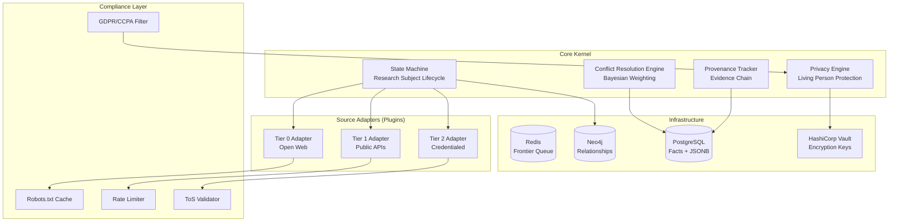
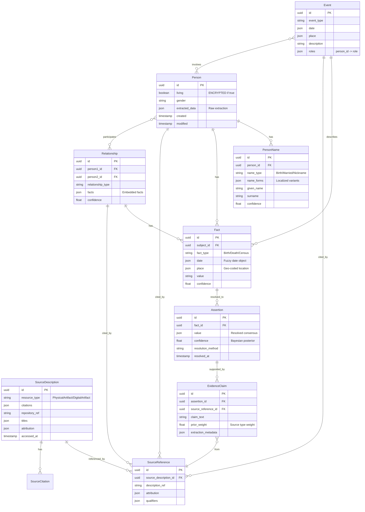
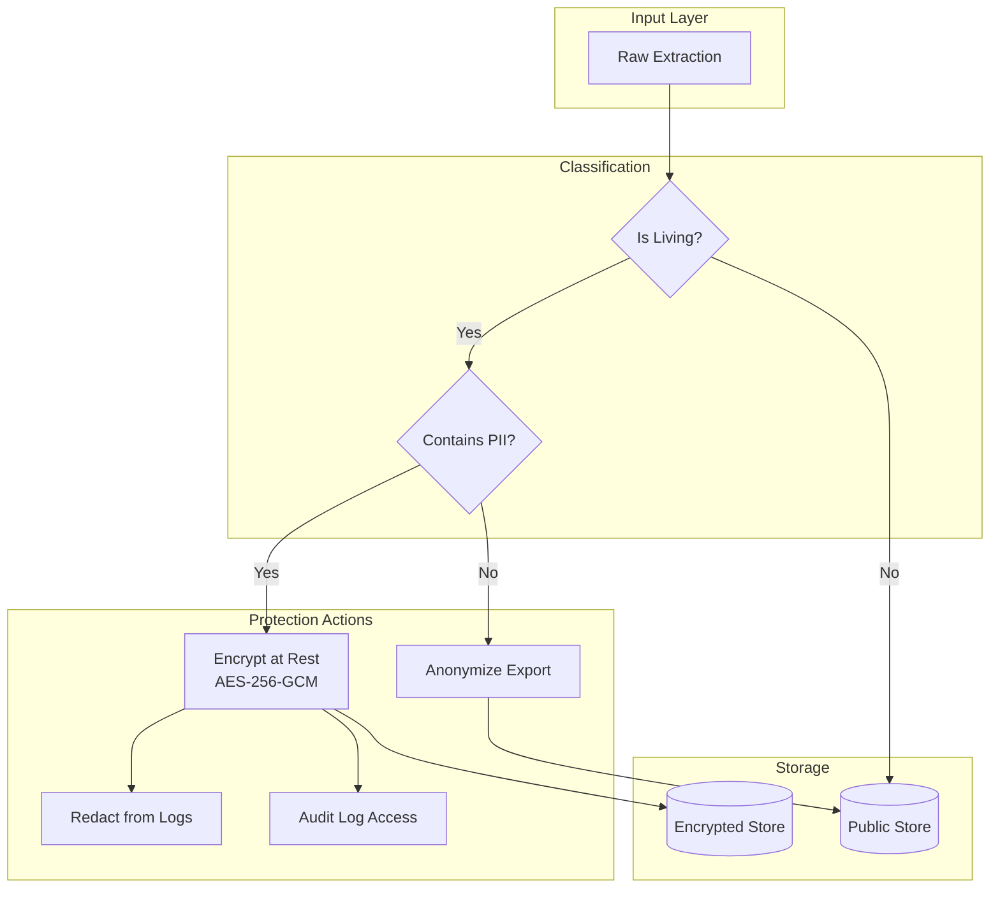
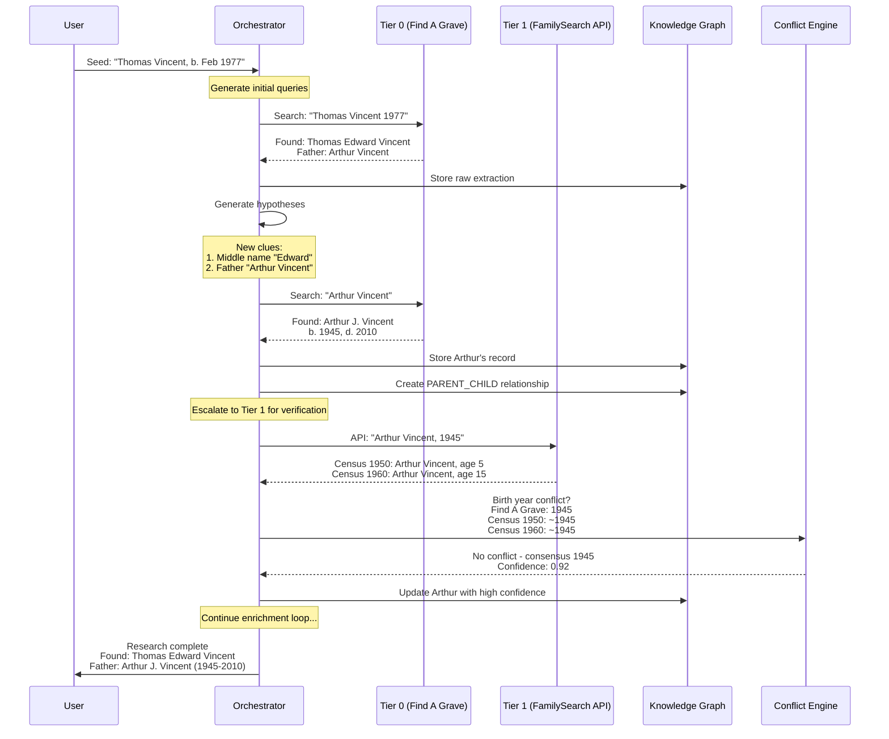

# Genealogical Process Crawler v2 - Enhanced Architecture

## Executive Summary

A **Micro-kernel architecture** crawler where the core handles state and provenance, while pluggable **Source Adapters** handle Tier-specific crawling. Features Bayesian conflict resolution, GDPR/CCPA compliance for living persons, and GEDCOM-X compatible data models.

---

## 1. System Architecture

### 1.1 Micro-Kernel Design



### 1.2 Iterative Enrichment Loop (State Machine)

```mermaid
stateDiagram-v2
    [*] --> Seeded: Initialize with seed person

    Seeded --> Frontier_Tier0: Generate initial queries

    state "Tier 0 Crawl" as Frontier_Tier0 {
        [*] --> Fetch_T0
        Fetch_T0 --> Parse_T0: robots.txt OK
        Fetch_T0 --> RateLimited_T0: 429/503
        RateLimited_T0 --> Fetch_T0: backoff
        Parse_T0 --> Extract_T0
        Extract_T0 --> [*]
    }

    Frontier_Tier0 --> FactExtraction: Raw records obtained

    state "Fact Extraction" as FactExtraction {
        [*] --> NER: spaCy NER pipeline
        NER --> DateParse: fuzzy date extraction
        DateParse --> GeoCode: place normalization
        GeoCode --> [*]
    }

    FactExtraction --> ConflictCheck: New facts extracted

    state "Conflict Resolution" as ConflictCheck {
        [*] --> CheckExisting
        CheckExisting --> NoConflict: No prior assertion
        CheckExisting --> HasConflict: Conflicting evidence
        HasConflict --> BayesianWeight: Calculate posterior
        BayesianWeight --> UpdateAssertion
        NoConflict --> CreateAssertion
        UpdateAssertion --> [*]
        CreateAssertion --> [*]
    }

    ConflictCheck --> HypothesisGen: Assertions updated

    state "Hypothesis Generation" as HypothesisGen {
        [*] --> AnalyzeFacts
        AnalyzeFacts --> GenRelativeQuery: Found relative name
        AnalyzeFacts --> GenLocationQuery: Found new location
        AnalyzeFacts --> GenDateRefine: Date range narrowed
        GenRelativeQuery --> NoveltyCheck
        GenLocationQuery --> NoveltyCheck
        GenDateRefine --> NoveltyCheck
        NoveltyCheck --> AddToFrontier: Query is novel
        NoveltyCheck --> Discard: Already executed
        AddToFrontier --> [*]
        Discard --> [*]
    }

    HypothesisGen --> RevisitCheck: Clues generated

    state "Revisit Scheduler" as RevisitCheck {
        [*] --> EvaluateClues
        EvaluateClues --> TriggerRevisit: High-value clue
        EvaluateClues --> SkipRevisit: Low priority
        TriggerRevisit --> PrioritizeQueue
        PrioritizeQueue --> [*]
        SkipRevisit --> [*]
    }

    RevisitCheck --> StopCondition: Check termination

    state "Stop Condition" as StopCondition {
        [*] --> CheckBudget
        CheckBudget --> BudgetExhausted: Over limit
        CheckBudget --> CheckConfidence: Budget OK
        CheckConfidence --> ConfidenceAchieved: Target met
        CheckConfidence --> CheckFrontier: Need more
        CheckFrontier --> FrontierEmpty: All done
        CheckFrontier --> Continue: More to process
        BudgetExhausted --> [*]: STOP
        ConfidenceAchieved --> [*]: STOP
        FrontierEmpty --> [*]: STOP
        Continue --> [*]: CONTINUE
    }

    StopCondition --> Frontier_Tier0: Continue loop
    StopCondition --> Frontier_Tier1: Escalate to Tier 1
    StopCondition --> Completed: Stop condition met

    state "Tier 1 API Crawl" as Frontier_Tier1 {
        [*] --> APICall
        APICall --> ParseJSON
        ParseJSON --> [*]
    }

    Frontier_Tier1 --> FactExtraction

    Completed --> [*]
```



### 1.3 Bayesian Conflict Resolution Flow

```mermaid
flowchart LR
    subgraph "Evidence Sources"
        BC[Birth Certificate<br/>Prior: 0.95]
        CR[Census Record<br/>Prior: 0.80]
        OB[Obituary<br/>Prior: 0.70]
        UT[User Tree<br/>Prior: 0.40]
    end

    subgraph "Bayesian Engine"
        PRIOR[Prior Weights]
        LIKELIHOOD[Likelihood<br/>P(Evidence|Fact)]
        POSTERIOR[Posterior<br/>P(Fact|Evidence)]
    end

    subgraph "Resolution"
        CONSENSUS[Consensus Value]
        CONFLICT[Preserved Conflicts]
        CONFIDENCE[Confidence Score]
    end

    BC --> PRIOR
    CR --> PRIOR
    OB --> PRIOR
    UT --> PRIOR

    PRIOR --> LIKELIHOOD
    LIKELIHOOD --> POSTERIOR
    POSTERIOR --> CONSENSUS
    POSTERIOR --> CONFLICT
    POSTERIOR --> CONFIDENCE
```

---

## 2. GEDCOM-X Compatible Data Model

### 2.1 Entity Relationship Diagram



---

## 3. Evidence Weighting Matrix

| Source Type | Evidence Class | Prior Weight | Notes |
|-------------|---------------|--------------|-------|
| Birth Certificate | Primary/Official | 0.95 | Created at time of event |
| Death Certificate | Primary/Official | 0.93 | May have errors on birth info |
| Census Record | Primary/Government | 0.80 | Self-reported, age rounding common |
| Church Register | Primary/Religious | 0.85 | Contemporary record |
| Newspaper Obituary | Secondary/Published | 0.70 | May contain errors from informant |
| Gravestone | Secondary/Memorial | 0.65 | Often erected years later |
| Family Bible | Secondary/Personal | 0.60 | May be filled in later |
| Compiled Genealogy | Authored | 0.50 | Quality varies widely |
| User-Submitted Tree | Authored/Unverified | 0.40 | Often copied without verification |
| AI Extraction | Derived | 0.30 | Requires human verification |

---

## 4. Privacy & Compliance

### 4.1 Living Person Detection Algorithm

```python
def is_living(person: Person) -> bool:
    """
    Conservative living status determination.
    GDPR/CCPA requires assuming living unless proven otherwise.
    """
    # Explicit death record
    if person.death_date:
        return False

    # Explicit living flag from source
    if person.living_flag is True:
        return True

    # Age-based heuristic (100-year rule)
    if person.birth_date:
        age = current_year - person.birth_date.year
        if age < 100:
            return True  # Assume living
        if age >= 120:
            return False  # Almost certainly deceased

    # Modern indicators (email, social media refs)
    if has_modern_identifiers(person):
        return True

    # Default: Assume living (conservative)
    return True
```

### 4.2 Data Protection Layers



### 4.3 GDPR/CCPA Compliance Checklist

| Requirement | Implementation |
|-------------|----------------|
| Right to Access | Export endpoint returns user's data |
| Right to Erasure | Cascade delete with audit trail |
| Data Minimization | Only store what's needed for research |
| Purpose Limitation | No commercial use of personal data |
| Storage Limitation | Auto-archive after research complete |
| Encryption at Rest | HashiCorp Vault for keys, AES-256-GCM |
| Access Logging | All PII access logged with reason |
| Consent Management | Credentialed sources require explicit consent |

---

## 5. Source Adapter Plugin Format

### 5.1 Adapter Interface

```python
from abc import ABC, abstractmethod
from typing import AsyncIterator

class SourceAdapter(ABC):
    """Base class for all source adapters."""

    @property
    @abstractmethod
    def tier(self) -> int:
        """Return source tier (0, 1, or 2)."""
        ...

    @property
    @abstractmethod
    def domain(self) -> str:
        """Return primary domain for rate limiting."""
        ...

    @abstractmethod
    async def search(
        self,
        query: SearchQuery,
    ) -> AsyncIterator[SearchResult]:
        """Execute search and yield results."""
        ...

    @abstractmethod
    async def fetch(
        self,
        url: str,
    ) -> FetchResult:
        """Fetch a specific resource."""
        ...

    @abstractmethod
    def extract(
        self,
        content: FetchResult,
    ) -> list[EvidenceClaim]:
        """Extract evidence claims from content."""
        ...

    @abstractmethod
    def get_compliance_config(self) -> ComplianceConfig:
        """Return compliance settings for this source."""
        ...
```

### 5.2 Example Adapter Configuration

```yaml
# adapters/find_a_grave.yaml
adapter_id: find_a_grave
display_name: "Find A Grave"
tier: 0
domain: findagrave.com

compliance:
  robots_txt: true
  rate_limit:
    requests_per_second: 0.2  # 1 req per 5 seconds
    burst: 3
  user_agent: "GenealogyResearchBot/2.0 (+https://example.com/bot)"
  respect_nofollow: true

evidence_weight:
  type: secondary
  subtype: memorial
  prior_weight: 0.65

extraction:
  person:
    name:
      selector: "h1#bio-name"
      confidence: 0.9
    birth_date:
      selector: "#birthDateLabel"
      parser: fuzzy_date
      confidence: 0.7
    death_date:
      selector: "#deathDateLabel"
      parser: fuzzy_date
      confidence: 0.8
    burial_place:
      selector: "#cemeteryNameLabel"
      geocode: true
      confidence: 0.9

search:
  endpoint: "/memorial/search"
  method: GET
  params:
    firstname: "{given_name}"
    lastname: "{surname}"
    birthyear: "{birth_year}"
    deathyear: "{death_year}"
  pagination:
    type: page_number
    param: page
    max_pages: 5
```

---

## 6. Concrete Walkthrough: Thomas Vincent

### Step-by-Step Enrichment



---

## 7. Technology Stack

| Component | Technology | Rationale |
|-----------|------------|-----------|
| Language | Python 3.11+ | Ecosystem, async support |
| Orchestration | Temporal.io | Long-running workflows, retries |
| Queue | Redis Streams | Ordered, persistent, distributed |
| Relational DB | PostgreSQL 15 | JSONB, full-text search |
| Graph DB | Neo4j | Relationship traversal, Cypher |
| Secrets | HashiCorp Vault | Encryption key management |
| Crawling | HTTPX + Playwright | Async + JS rendering |
| NLP | spaCy + custom NER | Name/date extraction |
| Caching | Redis | Response cache, rate limit tracking |
| Monitoring | OpenTelemetry | Distributed tracing |

---

## 8. Migration Path from v1

The existing `genealogy_crawler` package can be extended:

1. **Phase 1:** Add Bayesian conflict resolution to existing `ConflictOutput`
2. **Phase 2:** Add encryption layer for living persons
3. **Phase 3:** Replace in-memory queues with Redis
4. **Phase 4:** Add Neo4j for relationship graph (keep PostgreSQL for facts)
5. **Phase 5:** Implement Temporal.io workflows for long-running research

The existing Pydantic models can be enhanced rather than replaced.
