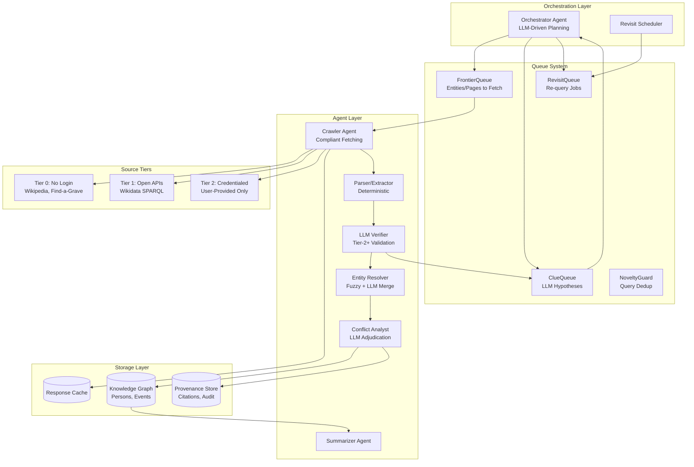
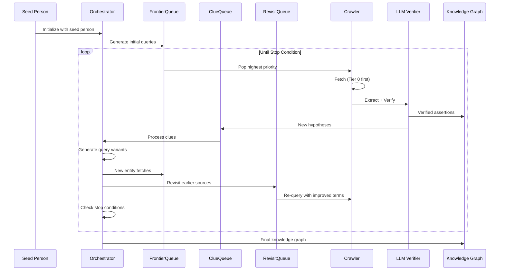
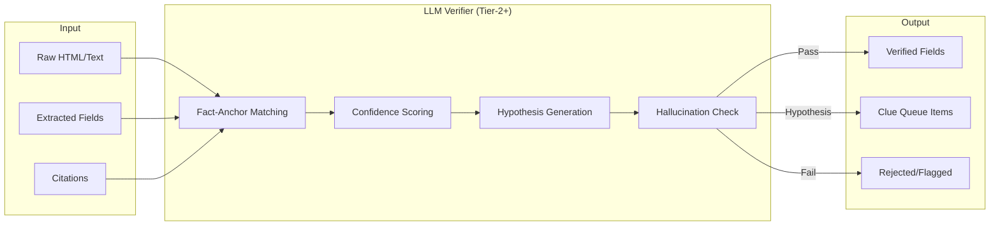
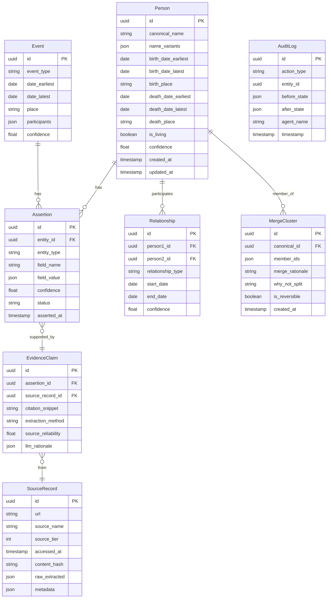
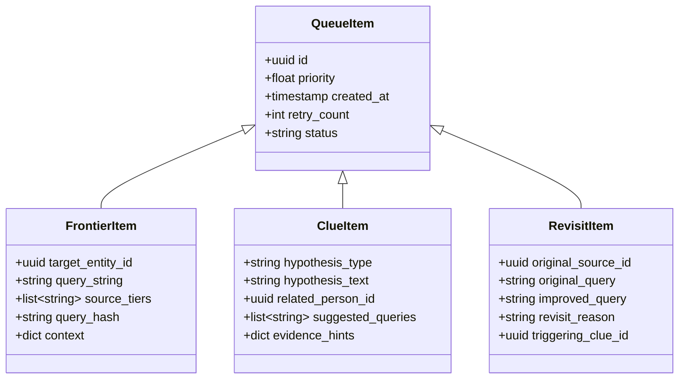

# Agentic Genealogical Process Crawler - Design Document

## Executive Summary

A Tier-2+ LLM-driven autonomous genealogical research system that discovers, extracts, verifies, and resolves genealogical evidence while maintaining strict provenance, respecting source constraints, and protecting privacy.

---

## 1. System Architecture

### 1.1 High-Level Architecture



### 1.2 Iterative Enrichment Loop



### 1.3 LLM Verification Pipeline



---

## 2. Data Model

### 2.1 Core Entities



### 2.2 Queue Data Structures



---

## 3. Agent Specifications

### 3.1 Orchestrator Agent (LLM-Driven)

**Role**: Plans tasks, manages budgets, schedules revisits, checks novelty

**LLM Prompt Contract**:
```
Input Schema:
{
  "current_state": {
    "persons_discovered": int,
    "assertions_made": int,
    "sources_queried": int,
    "budget_remaining": float,
    "frontier_size": int,
    "clue_queue_size": int
  },
  "recent_discoveries": [...],
  "pending_clues": [...],
  "stop_conditions": {...}
}

Output Schema:
{
  "next_actions": [
    {"action": "fetch|revisit|merge|stop", "target": "...", "priority": float}
  ],
  "query_expansions": [...],
  "revisit_recommendations": [...],
  "should_stop": boolean,
  "stop_reason": string | null
}
```

### 3.2 LLM Verification Agent (Tier-2+)

**Role**: Validates extractions, assigns confidence, generates hypotheses

**Tool Contract**:
```
Input:
{
  "url": "https://...",
  "raw_text": "...",
  "html_snippets": ["..."],
  "extracted_fields": {
    "name": "John Smith",
    "birth_date": "1890-05-12",
    ...
  },
  "citations": [
    {"field": "birth_date", "snippet": "born May 12, 1890"}
  ]
}

Output:
{
  "verified_fields": [
    {
      "field": "birth_date",
      "value": "1890-05-12",
      "status": "Verified",
      "confidence": 0.95,
      "citation_snippet": "born May 12, 1890",
      "rationale": "Explicit date in primary text"
    }
  ],
  "unverified_fields": [...],
  "contradictions": [...],
  "hypotheses": [
    {
      "type": "parental_discovery",
      "text": "Subject has 'Jr.' suffix, implying father with same name",
      "priority": 0.8,
      "suggested_queries": ["John Smith Sr.", "John Smith father"]
    }
  ],
  "hallucination_flags": []
}
```

### 3.3 Entity Resolver Agent

**Role**: Proposes merges with explainable scoring

**Merge Proposal Schema**:
```
{
  "candidate_pair": [uuid1, uuid2],
  "similarity_score": 0.85,
  "matching_features": {
    "name_similarity": 0.9,
    "date_overlap": 0.8,
    "place_match": 0.7,
    "relationship_consistency": 0.95
  },
  "merge_rationale": "Same name, overlapping dates, consistent family relationships",
  "why_not_merge": "Birth years differ by 2 years (1888 vs 1890)",
  "recommended_action": "merge_with_review",
  "reversible": true
}
```

### 3.4 Conflict Analyst Agent (LLM-Assisted)

**Role**: Adjudicates conflicting evidence

**Conflict Resolution Schema**:
```
{
  "conflict_id": uuid,
  "field": "birth_date",
  "competing_assertions": [
    {"value": "1890-05-12", "source_tier": 0, "confidence": 0.8},
    {"value": "1889-05-12", "source_tier": 1, "confidence": 0.6}
  ],
  "llm_analysis": {
    "evidence_ranking": [...],
    "recommended_value": "1890-05-12",
    "rationale": "Census record is primary source, death certificate is derivative",
    "next_actions": ["Seek birth certificate from county X"]
  },
  "resolution_status": "tentative"
}
```

---

## 4. Source Plugin Format

### 4.1 Plugin Schema (YAML)

```yaml
# Source Plugin: Find-a-Grave
plugin_id: find_a_grave
display_name: "Find a Grave"
tier: 0
base_url: "https://www.findagrave.com"

compliance:
  robots_txt: true
  rate_limit_requests_per_minute: 10
  rate_limit_burst: 3
  cache_ttl_seconds: 86400
  requires_auth: false
  tos_url: "https://www.findagrave.com/terms"

reliability:
  evidence_type: "secondary"
  base_weight: 0.7
  user_contributed: true

extraction_rules:
  person:
    name:
      selector: "h1#bio-name"
      type: "text"
      required: true
    birth_date:
      selector: "#birthDateLabel"
      type: "date"
      format: "fuzzy"
    death_date:
      selector: "#deathDateLabel"
      type: "date"
      format: "fuzzy"
    burial_place:
      selector: "#cemeteryNameLabel"
      type: "text"

search:
  endpoint: "/memorial/search"
  method: "GET"
  params:
    firstname: "{given_name}"
    lastname: "{surname}"
    birthyear: "{birth_year}"
    deathyear: "{death_year}"
  result_selector: ".memorial-item"

pagination:
  type: "page_number"
  param: "page"
  max_pages: 10
```

### 4.2 Plugin Registry

```yaml
# plugins/registry.yaml
sources:
  - id: wikipedia
    tier: 0
    config: plugins/wikipedia.yaml

  - id: wikidata
    tier: 1
    config: plugins/wikidata.yaml

  - id: find_a_grave
    tier: 0
    config: plugins/find_a_grave.yaml

  - id: familysearch
    tier: 2
    config: plugins/familysearch.yaml
    requires_credentials: true
```

---

## 5. Prompt Templates

### 5.1 Planner Prompt

```
SYSTEM: You are the Orchestrator for an autonomous genealogical research system.
Your role is to plan search strategies and decide when to revisit sources.

CRITICAL RULES:
1. You may NOT invent facts. Only propose hypotheses clearly labeled as such.
2. Prioritize Tier 0 (no login) sources before Tier 1/2.
3. Track query novelty - do not repeat near-identical searches.
4. Consider budget constraints and diminishing returns.

INPUT:
- Current knowledge graph state
- Recent discoveries
- Pending clues from LLM Verifier
- Budget remaining

OUTPUT (JSON):
{
  "reasoning": "Step-by-step planning logic",
  "next_actions": [
    {"action": "fetch", "query": "...", "source_tier": 0, "priority": 0.9}
  ],
  "revisit_schedule": [
    {"source_id": "...", "improved_query": "...", "reason": "..."}
  ],
  "should_stop": false,
  "stop_reason": null
}
```

### 5.2 Verifier Prompt

```
SYSTEM: You are the Verification Agent for genealogical fact extraction.
Your role is to validate extracted data against source text.

CRITICAL RULES:
1. You may NOT invent facts. If a fact is not in the source, mark it "Not Found".
2. Every verified field MUST have a citation_snippet from the source.
3. Hypotheses (e.g., "Jr." implies father) must be labeled as HYPOTHESIS, not fact.
4. Assign confidence 0.0-1.0 based on evidence clarity.

INPUT:
{
  "url": "source URL",
  "raw_text": "full text content",
  "extracted_fields": {"field": "value", ...},
  "existing_citations": [...]
}

OUTPUT (JSON):
{
  "verification_results": [
    {
      "field": "...",
      "value": "...",
      "status": "Verified|Unverified|Conflicting",
      "confidence": 0.0-1.0,
      "citation_snippet": "exact quote or null",
      "rationale": "explanation"
    }
  ],
  "hypotheses": [
    {
      "type": "...",
      "text": "...",
      "evidence_hint": "what triggered this",
      "priority": 0.0-1.0,
      "is_fact": false
    }
  ],
  "hallucination_flags": ["list of unsupported claims"]
}
```

### 5.3 Entity Resolver Prompt

```
SYSTEM: You are the Entity Resolution Agent.
Your role is to determine if two person records refer to the same individual.

CRITICAL RULES:
1. Provide explainable scoring for each matching feature.
2. Always include "why NOT merge" reasoning.
3. Merges must be reversible - never destroy data.
4. When uncertain, recommend "review" not "merge".

INPUT:
{
  "person_a": {...},
  "person_b": {...},
  "shared_assertions": [...],
  "conflicting_assertions": [...]
}

OUTPUT (JSON):
{
  "similarity_score": 0.0-1.0,
  "feature_scores": {
    "name": {"score": 0.9, "reason": "..."},
    "dates": {"score": 0.7, "reason": "..."},
    ...
  },
  "merge_rationale": "why these are the same person",
  "why_not_merge": "concerns or differences",
  "recommendation": "merge|review|separate",
  "confidence": 0.0-1.0
}
```

### 5.4 Conflict Analyst Prompt

```
SYSTEM: You are the Conflict Analyst for genealogical evidence.
Your role is to adjudicate when sources disagree.

CRITICAL RULES:
1. Rank evidence by: primary > secondary > authored; official > user-contributed.
2. Never fabricate a resolution - represent uncertainty honestly.
3. Suggest next actions to resolve conflicts (e.g., "seek birth certificate").
4. Preserve all competing assertions in the knowledge graph.

INPUT:
{
  "field": "birth_date",
  "competing_claims": [
    {"value": "1890", "source": "census", "tier": 0, "evidence_type": "primary"},
    {"value": "1889", "source": "obituary", "tier": 0, "evidence_type": "secondary"}
  ]
}

OUTPUT (JSON):
{
  "analysis": "step-by-step reasoning",
  "evidence_ranking": [
    {"claim_index": 0, "rank": 1, "reason": "..."}
  ],
  "recommended_value": "1890",
  "confidence": 0.7,
  "is_tentative": true,
  "next_actions": ["Seek birth certificate from county records"],
  "preserve_alternatives": true
}
```

---

## 6. Hallucination Firewall Checklist

### 6.1 Pre-Output Validation

```python
HALLUCINATION_CHECKS = [
    # 1. Citation Required
    "Every verified field has non-null citation_snippet",

    # 2. Citation Exists in Source
    "citation_snippet appears verbatim in raw_text",

    # 3. No Invented Dates
    "Date values match patterns found in source text",

    # 4. No Invented Names
    "Person names appear in source text",

    # 5. No Invented Places
    "Place names appear in source text",

    # 6. Hypothesis Labeling
    "All inferences are marked is_fact=false",

    # 7. Confidence Bounds
    "Confidence scores are between 0.0 and 1.0",

    # 8. No Fabricated URLs
    "All URLs in output exist in input",

    # 9. Relationship Grounding
    "Relationship claims cite specific evidence",

    # 10. Conflict Preservation
    "Conflicting claims are preserved, not overwritten"
]
```

### 6.2 Rejection Criteria

```python
def hallucination_firewall(llm_output: dict, source_text: str) -> tuple[bool, list[str]]:
    """
    Returns (passed, list_of_violations)
    """
    violations = []

    for result in llm_output.get("verification_results", []):
        # Check 1: Citation required for verified fields
        if result["status"] == "Verified" and not result.get("citation_snippet"):
            violations.append(f"Field '{result['field']}' verified without citation")

        # Check 2: Citation must exist in source
        snippet = result.get("citation_snippet", "")
        if snippet and snippet not in source_text:
            violations.append(f"Citation not found in source: '{snippet[:50]}...'")

    # Check 6: Hypotheses must not be marked as facts
    for hypo in llm_output.get("hypotheses", []):
        if hypo.get("is_fact", False):
            violations.append(f"Hypothesis incorrectly marked as fact: '{hypo['text'][:50]}'")

    return len(violations) == 0, violations
```

---

## 7. Stop Conditions

```python
STOP_CONDITIONS = {
    # Budget exhausted
    "budget_exhausted": lambda state: state.budget_used >= state.budget_limit,

    # Confidence threshold met
    "confidence_achieved": lambda state: (
        state.target_person_confidence >= 0.9 and
        state.generation_depth >= state.target_generations
    ),

    # Diminishing returns
    "diminishing_returns": lambda state: (
        state.recent_discovery_rate < 0.1 and  # <10% new info per query
        state.queries_since_last_discovery > 10
    ),

    # Frontier exhausted
    "frontier_empty": lambda state: (
        len(state.frontier_queue) == 0 and
        len(state.clue_queue) == 0 and
        len(state.revisit_queue) == 0
    ),

    # Max iterations
    "max_iterations": lambda state: state.iteration_count >= state.max_iterations,
}
```

---

## 8. Privacy Protection

### 8.1 Living Person Detection

```python
def is_likely_living(person: Person) -> bool:
    """Conservative check for living status."""
    current_year = datetime.now().year

    # Explicitly marked as living
    if person.is_living:
        return True

    # Has death date -> not living
    if person.death_date_earliest:
        return False

    # Born less than 100 years ago with no death date -> assume living
    if person.birth_date_latest:
        birth_year = person.birth_date_latest.year
        if current_year - birth_year < 100:
            return True

    # No dates at all -> check for modern context clues
    # (e.g., email addresses, social media references)
    return False
```

### 8.2 Redaction Rules

```python
PRIVACY_REDACTION_RULES = {
    "living_person": {
        "redact_fields": ["exact_birth_date", "address", "phone", "email", "ssn"],
        "generalize_fields": {
            "birth_date": "decade",  # "1990" -> "1990s"
            "birth_place": "state_country",  # Remove city/county
        },
        "preserve_fields": ["name", "relationships"]  # For tree building
    }
}
```
